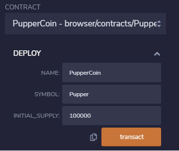
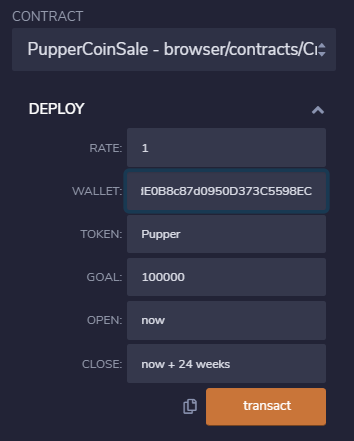
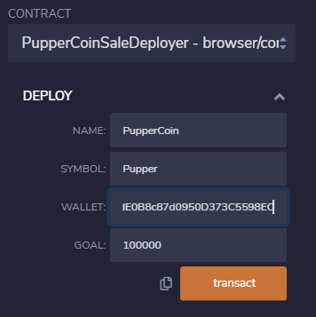

# You-sure-can-attract-a-crowd-

# Background
Your company has decided to crowdsale their PupperCoin token in order to help fund the network development.
This network will be used to track dog breeding activity across the globe in a decentralized way, and allow humans to track the genetic trail of their pets. You have already worked with the necessary legal bodies and obtained the green light on creating a crowdsale open to the public. However, you are required to enable refunds if the crowdsale is successful and the goal is met, and you are only allowed to raise a maximum of 300 ether. The crowdsale will run for 24 weeks.

You will need to create an ERC20 token that will be minted through a Crowdsale contract that you can leverage from the OpenZeppelin Solidity library.

This crowdsale contract will manage the entire process, allowing users to send ETH and get back PUP (PupperCoin).
This contract will mint the tokens automatically and distribute them to buyers in one transaction.

It will need to inherit Crowdsale, CappedCrowdsale, TimedCrowdsale, RefundableCrowdsale, and MintedCrowdsale.

You will conduct the crowdsale on the Kovan or Ropsten testnet in order to get a real-world pre-production test in.

# Instructions

### Follow the steps:

1. Create your project;

2. Designing the contracts:

    2.1. ERC20 PupperCoin;

    

    2.2. PupperCoinCrowdsale;

    

    2.3. PupperCoinCrowdsaleDeployer;

    

3. Testing the Crowdsale:

* Test the crowdsale by sending ether to the crowdsale from a different account;

### Deploying the Crowdsale

Deploy the crowdsale to the Kovan or Ropsten testnet, and store the deployed address for later. Switch MetaMask to your desired network, and use the Deploy tab in Remix to deploy your contracts. Take note of the total gas cost, and compare it to how costly it would be in reality. Since you are deploying to a network that you don't have control over, faucets will not likely give out 300 test ether. You can simply reduce the goal when deploying to a testnet to a much smaller amount, like 10,000 wei.